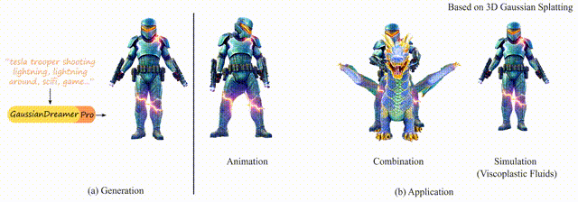

# GaussianDreamerPro: Text to Manipulable 3D Gaussians with Highly Enhanced Quality
### [Project Page](https://taoranyi.com/gaussiandreamerpro/) | [arxiv Paper](https://arxiv.org/)

[GaussianDreamer: Text to Manipulable 3D Gaussians with Highly Enhanced Quality](https://taoranyi.com/gaussiandreamerpro/)  

[Taoran Yi](https://github.com/taoranyi)<sup>1</sup>,
[Jiemin Fang](https://jaminfong.cn/)<sup>2†</sup>, [Zanwei Zhou](https://github.com/Zanue)<sup>3</sup>, [Junjie Wang](https://scholar.google.com/citations?view_op=list_works&hl=zh-CN&user=9Nw_mKAAAAAJ)<sup>2</sup>, [Guanjun Wu](https://guanjunwu.github.io/)<sup>1</sup>,  [Lingxi Xie](http://lingxixie.com/)<sup>2</sup>, </br>[Xiaopeng Zhang](https://scholar.google.com/citations?user=Ud6aBAcAAAAJ&hl=zh-CN)<sup>2</sup>,[Wenyu Liu](http://eic.hust.edu.cn/professor/liuwenyu/)<sup>1✉</sup>, [Xinggang Wang](https://xwcv.github.io/)<sup>1†</sup>, [Qi Tian](https://www.qitian1987.com/)<sup>2</sup> 

<sup>1</sup>HUST &emsp;<sup>2</sup>Huawei Inc. &emsp; <sup>3</sup>AI Institute, SJTU &emsp; 

<sup>†</sup>Project lead.  <sup>✉</sup>Corresponding author. 


Recently, 3D Gaussian splatting (3D-GS) has achieved great success in reconstructing and rendering real-world scenes. To transfer the high rendering quality to generation tasks, a series of research works attempt to generate 3D-Gaussian assets from text. However, the generated assets have not achieved the same quality as those in reconstruction tasks. We observe that Gaussians tend to grow without control as the generation process may cause indeterminacy. Aiming at highly enhancing the generation quality, we propose a novel framework named GaussianDreamerPro. The main idea is to bind Gaussians to reasonable geometry, which evolves over the whole generation process. Along different stages of our framework, both the geometry and appearance can be enriched progressively. The final output asset is constructed with 3D Gaussians bound to mesh, which shows significantly enhanced details and quality compared with previous methods. Notably, the generated asset can also be seamlessly integrated into downstream manipulation pipelines, e.g. animation, composition, and simulation etc., greatly promoting its potential in wide applications.

## 🦾 Updates
- 6/26/2024: Initializing the project, code will be coming soon.


## 📑 Citation
```
@article{GaussianDreamerPro,
    title={GaussianDreamerPro: Text to Manipulable 3D Gaussians with Highly Enhanced Quality},
    author={Yi, Taoran and Fang, Jiemin and Zhou, Zanwei and Wang, Junjie and Wu, Guanjun and Xie, Lingxi and Zhang, Xiaopeng and Liu, Wenyu and Wang, Xinggang and Tian, Qi},
    journal={arXiv preprint},
    year={2024}
}
```
